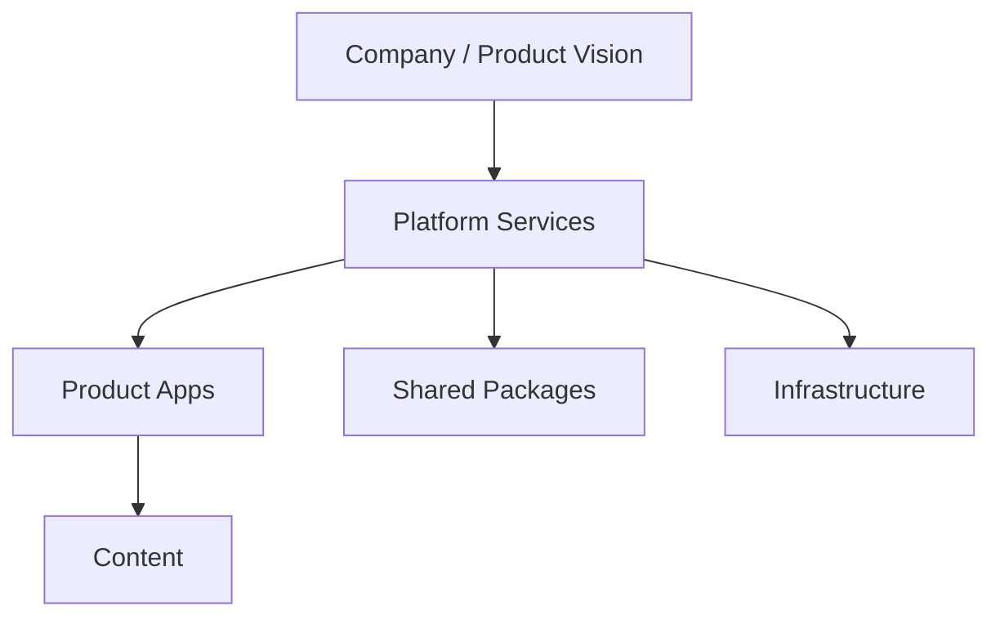

# Architecture Guide

This document summarizes the architectural approach used across Cyros Labs.

It is intentionally aligned with the repository-wide architecture documents in [docs/architecture/overview.md](docs/architecture/overview.md) and [docs/architecture/platform.md](docs/architecture/platform.md).

---

## Architectural Principles

Cyros Labs follows a platform-first model:

- Products focus on user experience.
- The platform provides reusable capabilities.
- Shared packages reduce duplication.
- Content is treated as independent from application logic.
- Products should remain loosely coupled from shared infrastructure.

---

## System Shape

At a high level, the repository is organized into four responsibilities:

- Company and product direction
- Shared platform capabilities
- Product applications
- Supporting packages, content, and infrastructure

---

## Layered Responsibilities

### Company

The company layer defines the mission, roadmap, and product direction. These concerns are captured in the documentation under [docs/company](docs/company).

### Platform

The platform layer owns capabilities that should not be reimplemented by every product. This includes identity, messaging, analytics, payments, search, storage, gamification, and monitoring.

### Products

Product applications live in [apps](apps). Each product should focus on its user experience and business flows while consuming platform capabilities.

### Shared Packages

Reusable libraries live in [packages](packages). These should hold code that can be consumed by more than one product or platform service.

### Infrastructure

Infrastructure and deployment assumptions are described in [docker](docker), [infraestructure](infraestructure), and [docs/architecture/deployment.md](docs/architecture/deployment.md).

---

## Boundaries

The repository guidance expects clear boundaries between layers:

- Products consume platform services rather than implementing their own shared infrastructure.
- Shared packages should remain generic and reusable.
- Content is maintained independently from application logic.
- Product-specific rules should not leak into the platform layer.

---

## Design and Delivery Guidance

The architecture is intended to support:

- Independent product delivery
- Shared platform evolution
- Consistent deployment and operational practices
- Stronger reusability across products

These goals are reflected in the monorepo strategy documented in [docs/architecture/monorepo.md](docs/architecture/monorepo.md).

---

## Related Documents

- [docs/architecture/overview.md](docs/architecture/overview.md)
- [docs/architecture/platform.md](docs/architecture/platform.md)
- [docs/architecture/repository-structure.md](docs/architecture/repository-structure.md)
- [docs/architecture/deployment.md](docs/architecture/deployment.md)
- [docs/architecture/security.md](docs/architecture/security.md)
