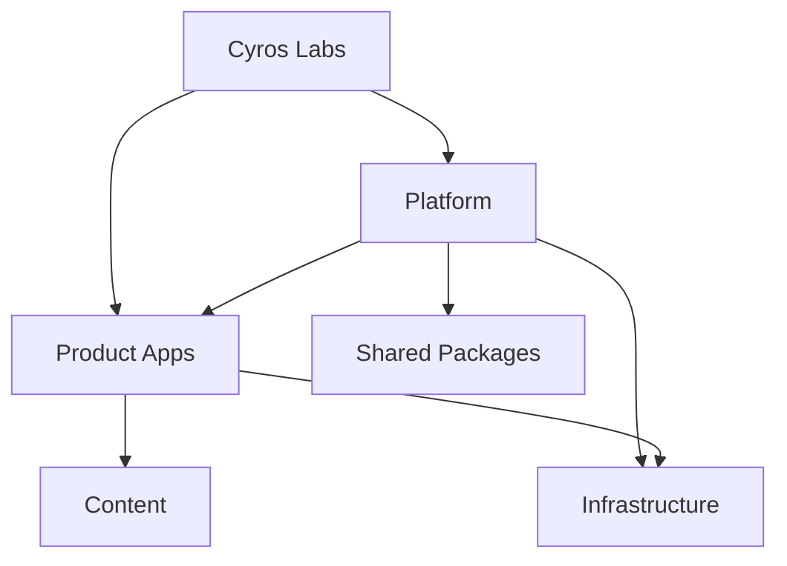

# Cyros Labs

> We build technology that helps people thrive.

Cyros Labs is a software studio focused on creating thoughtful technology that genuinely improves people's lives.

We believe technology should do more than automate tasks.

It should reduce stress, encourage growth, create opportunities, and help people become who they aspire to be.

Every product begins with a single question:

> "Will this genuinely improve someone's life?"

If the answer is no, we don't build it.

---

## Philosophy

We don't build apps.

We build companions for life.

---

## Vision

To create thoughtful technology that helps people learn, grow, connect, and thrive.

---

## Products

Cyros Labs develops products across different areas of everyday life.

### 🧠 Mind

* Haru Haru
* Companion
* Challenges

### ❤️ Well-being

* Diet Buddy
* Workout
* Diet Planner

### 🏡 Home

* Smart Pantry
* Price Tracker

### 💼 Work

* Restaurant Platform
* Invoices
* Consulting Platform
* Reports

### 💻 Creation

* Public API Platform
* Debugger

### ⏳ Time

* Goals
* Time Tracker

### 🎮 Joy

* Race Game

The repository may contain products at different stages of development. The current primary product under active development is **Haru Haru**.

---

## Architecture

Cyros Labs follows a **platform-first architecture**.

Products own their user experiences and product-specific business flows.

The Platform provides reusable capabilities that should not be independently reimplemented by each product.

Shared Packages provide generic technical functionality that can be reused by products and platform services.

Content is maintained independently from application logic.

Infrastructure provides the deployment and operational foundation for the system.

The goal is to keep products independently evolvable while allowing them to share a common technological foundation.



The key architectural boundaries are:

* **Products** own product-specific experiences, rules, and business flows.
* **Platform** owns shared product capabilities.
* **Shared Packages** provide generic reusable technical functionality.
* **Content** contains product content independent from application logic.
* **Infrastructure** provides deployment and operational capabilities.

Products should not depend directly on other products. Shared capabilities should be provided through the Platform or appropriate Shared Packages.

See the [Architecture Documentation](docs/architecture/overview.md) for the complete architectural model.

---

## Repository Structure

```text
apps/             Product applications
platform/         Shared platform capabilities
packages/         Shared technical libraries
content/          Product content
docs/             Project documentation
.ai/              AI agents, workflows, rules, and context
docker/           Local development environment
infrastructure/   Infrastructure and deployment
scripts/           Automation scripts
tools/             Development and engineering tools
```

For the detailed repository structure, see [Repository Structure](docs/architecture/repository-structure.md).

---

## Engineering Principles

* Human First
* Platform First
* AI Native
* Modular by Design
* Reuse Before Rebuild
* Simplicity Over Complexity
* Build for the Long Term

These principles guide both product development and engineering decisions across the repository.

---

## Current Focus

Cyros Labs is currently focused on **Haru Haru**, a Korean learning platform designed to make language learning engaging, meaningful, and confidence-building.

The application lives in [`apps/haru-haru`](apps/haru-haru).

See the [Haru Haru README](apps/haru-haru/README.md) for product and development-specific information.

---

## Development

The repository is a multi-area codebase. Development instructions are organized by concern rather than duplicated across individual projects.

### Core Documentation

* [Getting Started](docs/development/getting-started.md)
* [Local Environment](docs/development/local-environment.md)
* [Docker](docs/development/docker.md)
* [Tooling](docs/development/tooling.md)
* [Debugging](docs/development/debugging.md)
* [Troubleshooting](docs/development/troubleshooting.md)
* [FAQ](docs/development/faq.md)

### Architecture

* [Architecture Overview](docs/architecture/overview.md)
* [Platform Architecture](docs/architecture/platform.md)
* [Platform Boundaries](docs/architecture/platform-boundaries.md)
* [Repository Structure](docs/architecture/repository-structure.md)
* [Monorepo Strategy](docs/architecture/monorepo.md)
* [System Design](docs/architecture/system-design.md)
* [Technology Stack](docs/architecture/tech-stack.md)
* [API Guidelines](docs/architecture/api-guidelines.md)
* [Deployment](docs/architecture/deployment.md)
* [Security](docs/architecture/security.md)
* [Scalability](docs/architecture/scalability.md)
* [Decision Principles](docs/architecture/decision-principles.md)

### Engineering

* [Testing](docs/engineering/testing.md)
* [Release Process](docs/engineering/release-process.md)

### Project

* [Contributing](CONTRIBUTING.md)
* [Glossary](docs/GLOSSARY.md)

---

## AI-Assisted Development

Cyros Labs is designed to support AI-assisted software development.

The `.ai/` directory contains the project's AI engineering system:

```text
.ai/
├── agents/       Specialized engineering agents
├── workflows/    Standard development workflows
├── rules/        Engineering and architectural rules
└── context/      Project context and reference information
```

AI agents should follow the repository's architectural, coding, security, and workflow rules when modifying the project.

The AI system complements the project documentation rather than replacing it.

---

## Git Workflow

The `main` branch is protected by repository rules.

Changes should be developed on dedicated branches and merged through pull requests.

The repository ruleset is defined in `.github/ruleset.yml`.

See [Contributing](CONTRIBUTING.md) for development and contribution guidelines.

---

## Long-Term Vision

Cyros Labs aims to build an ecosystem of connected products that improve different pillars of everyday life.

Each product should be useful and evolvable on its own.

Together, shared platform capabilities can allow products to provide more value without creating direct product-to-product coupling.

---

## License

This repository is licensed under the Apache License 2.0.
