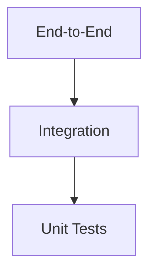

# Testing Guide

This repository documents a testing-first engineering culture, but the implementation footprint is still emerging.

The source-of-truth guidance is in [docs/engineering/testing.md](docs/engineering/testing.md).

---

## Testing Philosophy

Quality should be built into the development process.

The repository expects:

- Unit tests for isolated behavior
- Integration tests for service and component collaboration
- End-to-end tests for key user flows
- Manual validation for usability and accessibility

---

## Test Pyramid

The repository guidance prefers many unit tests, fewer integration tests, and a small number of end-to-end tests.

---

## What to Test

Priority should be given to behaviors that matter most to the product and platform:

- Authentication and authorization
- Lesson progression and learning state
- Billing and subscription flows where relevant
- API contracts and platform integrations
- Critical regression cases

---

## Regression Testing

Every bug fix should include a regression test whenever practical.

---

## Performance and Accessibility

The engineering guidance also calls for:

- Response-time validation for critical workflows
- Resource usage checks
- Accessibility review for user-facing experiences

---

## CI Expectations

Every pull request should run the relevant automated checks before merge.

These checks should include:

- Linting
- Unit and integration tests
- Build validation

---

## Related Documents

- [docs/engineering/testing.md](docs/engineering/testing.md)
- [docs/engineering/release-process.md](docs/engineering/release-process.md)
- [DEVELOPMENT.md](DEVELOPMENT.md)
